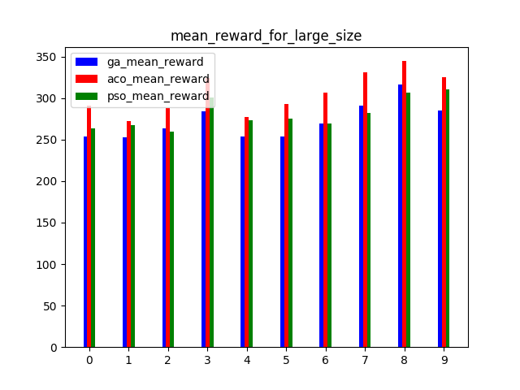
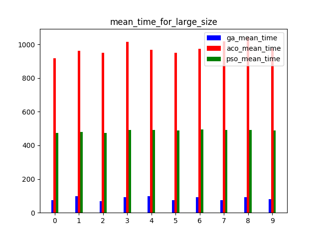

# Multi-UAV Task Assignment Benchmark
## 多无人机任务分配算法测试基准

## Introduction
A benchmark for multi-UAV task assignment is presented in order to evaluate different algorithms. An extended Team Orienteering Problem is modeled for a kind of multi-UAV task assignment problem. Three intelligent algorithms, i.e., Genetic Algorithm, Ant Colony Optimization and Particle Swarm Optimization are implemented to solve the problem. A series of experiments with different settings are conducted to evaluate three algorithms. The modeled problem and the evaluation results constitute a benchmark, which can be used to evaluate other algorithms used for multi-UAV task assignment problems.

  

  

  

Please refer to the paper to see more detail.

Xiao, K., Lu, J., Nie, Y., Ma, L., Wang, X., Wang, G.: A Benchmark for Multi-UAV Task Assignment of an Extended Team Orienteering Problem. arXiv preprint **[ arXiv:2009.00363](https://arxiv.org/abs/2009.00363)**  (2020)


## Usage

### 1. Algorithm input and output

Algorithm input includes vehicle number (scalar),  speeds of vehicles ($n\times1$ array), target  number (scalar $n$),  targets ($(n+1)\times4$ array, the first line is depot, the first column is x position, the second column is y position, the third column is reward and the forth column is time consumption to finish the mission), time limit (scalar).  The code below is the initialization of the class GA in `ga.py`.

```python
def __init__(self, vehicle_num, vehicles_speed, target_num, targets, time_lim)
```

There should be a function called `run()` in the algorithm class, and the function should return task assignment plan(array, e.g. [[28, 19, 11], [25, 22, 7, 16, 17, 23], [21, 26, 12, 9, 6, 3], [5, 15, 1], [18, 20, 29]], each subset is a vehicle path) and computational time usage (scalar). 

### 2. Evaluate

You can replace one algorithm  below with another algorithm in `evaluate.py`, and then `python evaluate.py`. If you don't want to evaluate three algorithm together, you should modify the code properly( this is easy).    

```python
ga = GA(vehicle_num,env.vehicles_speed,target_num,env.targets,env.time_lim)
aco = ACO(vehicle_num,target_num,env.vehicles_speed,env.targets,env.time_lim)
pso = PSO(vehicle_num,target_num ,env.targets,env.vehicles_speed,env.time_lim)
ga_result=p.apply_async(ga.run)
aco_result=p.apply_async(aco.run)
pso_result=p.apply_async(pso.run)
p.close()
p.join()
ga_task_assignmet = ga_result.get()[0]
env.run(ga_task_assignmet,'GA',i+1,j+1)
re_ga[i].append((env.total_reward,ga_result.get()[1]))
env.reset()
aco_task_assignmet = aco_result.get()[0]
env.run(aco_task_assignmet,'ACO',i+1,j+1)
re_aco[i].append((env.total_reward,aco_result.get()[1]))
env.reset()
pso_task_assignmet = pso_result.get()[0]
env.run(pso_task_assignmet,'PSO',i+1,j+1)
re_pso[i].append((env.total_reward,pso_result.get()[1]))
```

### 3. About reinforcement learning

In `Env()` in `evaluate.py`, function `step` is used for reinforcement learning. Because this is still being developed, we cannot supply a demo. If your algorithm is reinforcement learning, you can try to train it with `Env()`. Your pull request and issue are welcome.